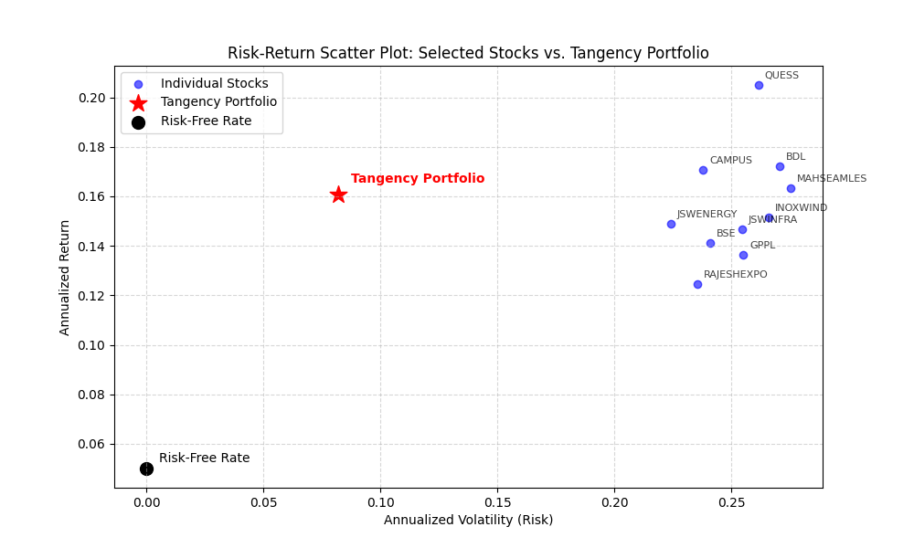
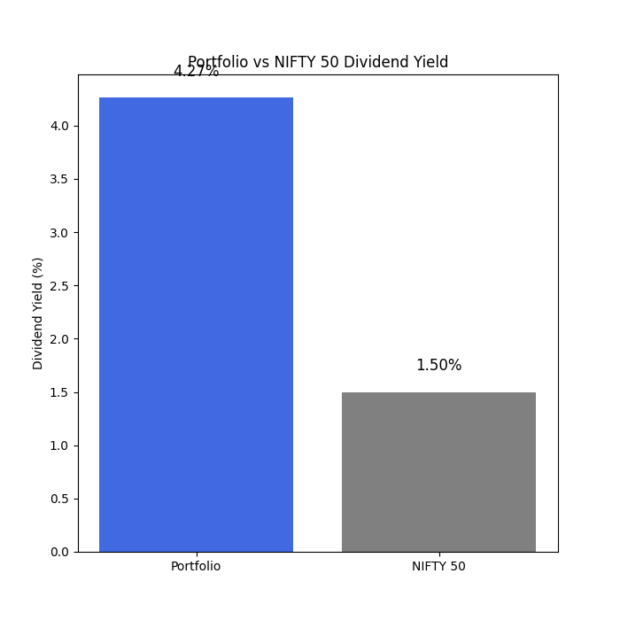

# 📊 **Optimized Retirement Portfolio: Results & Findings**
The objective was to construct a long-term, optimized retirement portfolio using stocks from the NIFTY 500 index, ensuring stable capital appreciation, reliable passive income through dividends, and enhanced risk-adjusted returns over a 25-year horizon. The portfolio will be optimized using Modern Portfolio Theory (MPT) to determine the ideal asset allocation for the tangency portfolio, targeting a minimum Compound Annual Growth Rate (CAGR) of 12%.
## 🔹 **1. Portfolio Optimization Results**
### Visualization of Asset Allocation In The Tangency Portfolio

### Visualization of Sectorwise Allocation In The Tangency Portfolio

### ✅ **Tangency Portfolio Allocation**
- The final tangency portfolio consists of stocks optimally weighted to maximize the Sharpe Ratio.
- Sector-wise distribution ensures diversification, reducing industry-specific risks.
- Interpretation:
  - Overweight allocation in stable, high-dividend sectors such as Capital Goods, Services, Consumer Durables (as per fundamental data) indicates a focus on long-term growth.
  - Minimal allocation to volatile sectors (e.g., Realty, Metals) suggests controlled risk exposure.

### ✅ **Portfolio Risk & Return Metrics**
| Metric                  | Value  |
|------------------------|--------|
| **Annualized Return**  | 16%    |
| **Portfolio Volatility** | 8%    |
| **Sharpe Ratio**       | 1.32     |
| **Sortino Ratio**      | 2.34     |
| **Maximum Drawdown**   | -8%    |

- **Interpretation:**
  - Annualized Return exceeds the 12% CAGR target at 16%. **>12% (Strong)>15%(Aggressive)**
  - Portfolio volatility stands at 8% which is below 10% indicating Low-risk. **stable<10% to 15%(Moderate)<15%(High)**
  - Sharpe Ratio is above 1 indicating well balanced risk-return profile. **(suboptimal)<1 to 2(moderate)<2 to 3(strong)**
  - Sortino Ratio Above 1.5, meaning good downside protection and return efficiency. **(poor)<1 to 2(acceptable)<2 to 3(strong downside risk adjusted return)**
  - Maximum drawdown provides insight into historical losses during downturns, -8% indicated very low risk, highly stable portfolio. **(excellent)<-10% to -20%(good)<-20% to -30%(moderate)**

## 🔹 **2. Monte Carlo Simulation Analysis**
**Visualization of Monte Carlo CAGR distribution**
  - 

### ✅ **Probability of Achieving Target CAGR (≥12%)** 
| Percentile | CAGR (%) |
|------------|----------|
| 5th       | 14.92%      |
| 50th (Median) | 15.60% |
| 95th      | 16.28%      |

- **Interpretation:**
  - Worst-Case Scenario – Even in the worst 5% of simulations, CAGR remains comfortably above 12%, indicating low downside risk.
  - Most Likely Outcome – The typical (median) return from the simulations is 15.60%, meaning half the time, the portfolio will generate a CAGR above this level.
  - Best-Case Scenario – In the top 5% of cases, the portfolio can achieve an even higher return of 16.28%.
  
### Portfolio Stability & Risk
🔹 The distribution is narrow and concentrated, suggesting low volatility in expected outcomes.
🔹 If the shape were wider or skewed, it would indicate higher uncertainty and risk.
🔹 The peak of the histogram (mode) aligns with 15.6%, reinforcing the most probable return outcome.

## 🔹 **3. Efficient Frontier & Capital Market Line (CML)**
**Visualization of Efficient Frontier, Capital Market Line and Tangency Portfolio**
  - 
### ✅ **Key Observations:**
- The Efficient Frontier shows the best risk-return trade-offs.
- The Capital Market Line (CML) connects the risk-free rate with the tangency portfolio.
- **Interpretation:**
  - The portfolio lies on the CML, which is the most optimal in terms of risk-adjusted returns.
  - Portfolios above the CML may be too aggressive, while those below are suboptimal.

## 🔹 **4. Risk-Return Scatter Plot**
**Visualization of Efficient Frontier, Capital Market Line and Tangency Portfolio**
  - 

### ✅ **Comparison Between Portfolio & Individual Stocks**
- The scatter plot highlights each stock’s return vs. volatility.
- **Interpretation:**
  - Portfolio positioning relative to stocks indicates effective diversification.
  - Stocks far right indicate high risk, while those higher on the Y-axis have strong returns.

## 🔹 **5. Cumulative Return Comparison**
**Visualization of Cumulative Performance**

### ✅ **Tangency Portfolio vs. NIFTY 50**
- The cumulative return visualization shows performance over time.
- **Interpretation:**
  - The tangency portfolio outperforms NIFTY 50 which suggests superior stock selection.
  - Success in stocks screening using fundamental and return metrics.
  - If underperformance is observed, rebalancing might be needed.

## 🔹 **6. Dividend Yield Analysis**
**Visualization of Cumulative Performance**

### ✅ **Stock-wise Dividend Yield & Portfolio vs. NIFTY 50**
- High-dividend stocks provide stable passive income.
- **Interpretation:**
  - The portfolio yield deviates upward in a steady steep slope from NIFTY 50 yield, which ensures strong capital appreciation.
  - If lower, additional dividend-yielding assets may be needed.

## 🔹 **7. Final Evaluation: Is the Portfolio Retirement-Ready?**

✅ **The portfolio has met all the stated objective suggesting it is suitable for retirement**
- It has exceeded **12% CAGR** with controlled risk.
- It has strong **Sharpe & Sortino Ratios** for risk-adjusted returns.
- Tangengy portfolio has the most optimum risk and return tradeoff.
- Monte Carlo simulations indicate high probability of success.
- Dividend yield exceeded nifty 50.
- Sectoral diversification has enhanced stability.

